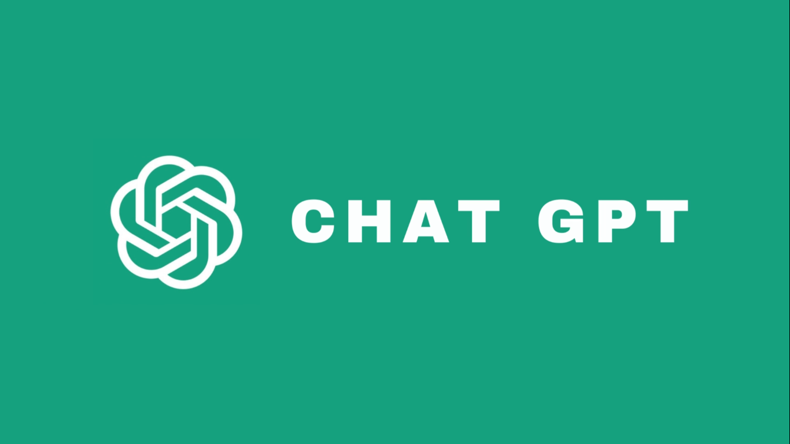

# ChatGPT: Unlocking Productivity with Advanced Conversational AI

*Introduction:*
--------------
Ever since the introduction of ChatGPT, I've been captivated by its potential to enhance productivity and streamline communication. As an avid user of ChatGPT for both work and school, I've discovered various techniques to leverage its power effectively. In this blog post, I'll share my insights on how to use ChatGPT prompts correctly to obtain accurate and valuable responses.

<!--truncate-->

## Understanding ChatGPT

ChatGPT is not your ordinary chatbot—it's an advanced conversational AI developed by OpenAI. Built on the powerful GPT-3.5 architecture, ChatGPT utilizes deep learning to generate human-like responses based on the provided prompts. With its remarkable language generation capabilities, ChatGPT has revolutionized the way we interact with AI models.

## Importance of Prompts

*Be specific with your prompts*
To get the most accurate responses from ChatGPT, it's crucial to craft specific prompts. Avoid vague or open-ended questions that might lead to less precise answers. Instead, clearly define your request, keeping the prompt concise and focused.

*Example prompt:* "What are the key features of ChatGPT that set it apart from other AI models?"

*Provide context for better understanding*
Complex queries often require additional context for ChatGPT to provide accurate responses. By including relevant information, background details, or specific examples in the prompt, you can enhance the accuracy and depth of the generated response.

*Example prompt:* "Given a dataset of customer reviews, how can I use ChatGPT to extract sentiment analysis and identify positive and negative feedback?"

*Utilize system messages for guidance*
System messages are a powerful tool to guide ChatGPT's responses. By including a system message at the beginning of the conversation, you can nudge the AI model towards a specific direction or behavior. This helps in obtaining more precise and desired outputs.

*Example prompt:*
> User: "How can I improve the accuracy of my machine learning model?"
> 
> AI: "To improve model accuracy, consider increasing the training dataset, fine-tuning hyperparameters, and implementing regularization techniques."

*Iterative refinement for better results*
If the initial response from ChatGPT is not accurate or satisfactory, don't hesitate to refine and iterate on your prompt. Experiment with different phrasings or ask ChatGPT to think deeper, consider alternative approaches, or provide more detailed explanations.

## Best Practices and Limitations

*Fact-checking is essential*
While ChatGPT can provide informative responses, it's crucial to fact-check the information it generates. ChatGPT's responses are based on pre-existing data and may not always be up-to-date or entirely accurate. Verify important facts from reliable sources to ensure the information's validity.

*Ethical considerations matter*
ChatGPT follows ethical guidelines and has certain limitations in generating harmful or inappropriate content. However, it's always a good practice to monitor the generated responses and be cautious of any potential biases or offensive content. OpenAI provides moderation tools to help filter and control the AI's output.

*Experiment and learn from ChatGPT*
ChatGPT's performance can vary based on the prompt and the specific task at hand. Experiment with different prompts, system messages, and refining techniques to find what works best for your specific use case. Learn from the model's responses and adjust your approach accordingly to improve accuracy and productivity.

*Conclusion*
-----------
ChatGPT has transformed the way we interact with AI models, offering an unprecedented level of conversational capabilities. By understanding the importance of prompts and employing effective techniques, we can unlock ChatGPT's full potential and revolutionize our productivity. So, go ahead, craft your prompts wisely, and explore the vast possibilities that ChatGPT has to offer!
